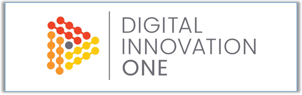
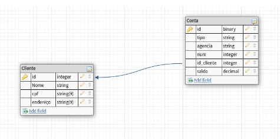

<!-- Badges session -->

  
  <!-- languages -->
  
  <!-- repo size -->
  
  <!-- last commit -->
  
  <!-- licence MIT -->
  

<!--Banner session-->

<!--About session-->
<h1 align="center">Formação Python Developer Digital Innovation One</h1>

# Implementando um Banco de Dados Relacional com SQLAlchemy

## Objetivo:
Neste desafio foi implementadp uma aplicação de integração com SQLite com base em um esquema relacional disponibilizado. 
Sendo assim, utilizado o esquema dentro do contexto de cliente e conta para criar as classes de sua API.
Essas classes irão representar as tabelas do banco de dados relacional dentro da aplicação.

<!--Banner session-->

#### Entregável:
-- Aplicação com a definição do esquema por meio das classes usando SQLAlchemy
-- Inserção de um conjunto de dados mínimo para manipulação das informações
-- Execução de métodos de recuperação de dados via SQLAlchemy
 
Iremos implementar um banco NoSQL com mongodb para fornecer uma visão agregada do modelo relacional. 
Sendo assim, as informações de cliente e contas existentes estão contidas dentro de documentos de acordo com cliente.

#### Execute as operações:

-- Conecte ao mongo atlas e crie um banco de dados
-- Defina uma coleção bank para criar os documetos de clientes
-- Insira documentos com a estrutura mencionada
-- Escreve instruções de recuperação de informações com base nos pares de chave e valor como feito em aula
 
<!--Orientador session-->
### Orientador:
Juliana Mascarenhas 
Data Scientist, DIO

##
<!--Bottom session-->
<h4 align=center>Made with by <a href="https://www.linkedin.com/in/gdmacedo/">Macedo, Glener Diniz</a></h4>

